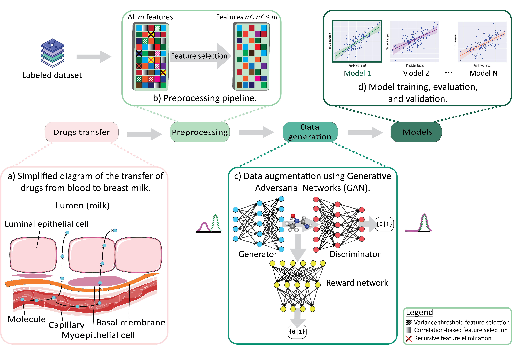

# Summary

Breastfeeding offers numerous benefits for infants health and
development [@binns2016long; @lawrence2000breastfeeding; @allen2005benefits]. However, it also presents a risk of
transmitting harmful molecules from maternal plasma into breast milk. Recognizing the need to predict the transfer ratio
of environmental chemicals and pharmaceuticals into breast milk [@ito2003drug], this paper introduces **qsarKit**, a
predictive software package. **qsarKit** incorporates a comprehensive preprocessing and feature selection pipeline to
optimize the input data, along with a multi-functional Quantitative Structure-Activity Relationship (
QSAR) [@leveque2022quantitative] approach leveraging machine learning to predict the biological activity of various
molecules across different scenarios. The package includes six distinct machine learning models, a Generative
Adversarial Network (GAN) [@goodfellow2014generative] to augment the dataset, and robust training optimization and
evaluation methods to enhance model performance. Details on the implementation of **qsarKit** can be accessed on
GitHub: [https://github.com/tahiri-lab/QSAR](https://github.com/tahiri-lab/QSAR) and
PyPI: [https://pypi.org/project/qsarKit/](https://pypi.org/project/qsarKit/).

# Statement of need

The advancement and accessibility of QSAR modeling tools are crucial for expediting research in chemical and
pharmaceutical domains [@tropsha2010]. Despite their importance, many existing QSAR tools are encumbered with
limitations such as prohibitive licensing fees and rigid frameworks, which do not cater to the diverse needs of the
research community. A notable example is the MOE software [@MOE2022], whose high costs and lack of customization options
restrict its usage among researchers with limited resources.

To address these challenges, **qsarKit** is introduced as an innovative solution. As an open-source framework, it not
only removes financial barriers but also provides a flexible environment for QSAR modeling. This accessibility enables a
broader range of scientists and researchers to engage in high-level chemical-biological interaction analyses, fostering
an inclusive research ecosystem. Furthermore, by incorporating GANs, **qsarKit** enhances the size of datasets available
for QSAR studies, addressing the common challenge of limited dataset variability. Such improvements are crucial for the
accurate prediction of chemical interactions in biological systems, underscoring the need for versatile and accessible
QSAR modeling tools like **qsarKit**.

# Methodologies

The **qsarKit** package introduces a comprehensive approach to developing QSAR models, addressing challenges in data
preprocessing, augmentation, and model training with an integrated pipeline designed for both flexibility and
efficiency.

## Preprocessing

The preprocessing phase in **qsarKit** (\autoref{fig:pipeline}.b) begins with feature
selection [@Comesana2022], aimed at enhancing model performance and interpretability. Features demonstrating low
variance across the dataset are eliminated, as they contribute minimal predictive power. This selection is based on the
variance threshold technique, ensuring that only features contributing significantly to model diversity are retained.
Additionally, to address the challenge of multicollinearity[@remeseiro2019review], a correlation-based feature selection
is applied using rank correlation coefficient of *Kendall* [@prematunga2012correlational]. Features exceeding this
threshold are systematically removed [@hall2000correlation]. Further refinement is achieved through Recursive Feature
Elimination (*RFE*) [@guyon2002gene], a process that systematically reduces the feature set to those most significant
for model prediction, thereby improving both model interpretability and performance.

## Data augmentation using generative adversarial networks

To counter the prevalent issue of limited and imbalanced QSAR datasets, **qsarKit** employs a GAN
(\autoref{fig:pipeline}.c) for data augmentation. This approach addresses the shortcomings of traditional datasets by
generating new, plausible molecular structures, thereby expanding the diversity and size of the training
set [@decao2018molgan]. The GAN module comprises a *Featurizer*, which prepares molecular structures in SMILES format
for processing, followed by the GAN itself, which trains on available data to produce new molecular structures. The
generated structures are then converted back into quantitative features through the *Descriptor Extraction* process,
making them suitable for subsequent QSAR modeling.

## Model training and optimization

**qsarKit** supports six core models (\autoref{models}), including both regression and ensemble methods, tailored for
QSAR analysis. This selection grants users the flexibility to choose the most appropriate model for their data and
objectives. Model training in **qsarKit** is rigorously evaluated using cross-validation techniques, ensuring the
models' generalization capabilities to unseen data. Special emphasis is placed on maintaining the original distribution
of chemical properties and response variables through strategic binning and stratification, thereby preserving the
integrity and representativeness of the dataset.

: Notations and variables used in **qsarKit**. \label{notations}

| Variable                |           Notation           |
|-------------------------|:----------------------------:|
| Number  of Data         |             $n$              |
| Target value            |            $y_i$             | 
| Prediction of the model | $\hat {y_i} = h_\theta(y_i)$ | 
| Penality term           |          $\lambda$           |
| Cost function           |         $J(\theta)$          | 
| Regularisation function |           $\Omega$           |
| Decision trees          |            $f_k$             |

: Available models in **qsarKit** and their respective loss functions. \label{models}

| Models                                   |                                                                                    Equation                                                                                     |
|------------------------------------------|:-------------------------------------------------------------------------------------------------------------------------------------------------------------------------------:|
| Ridge Regression [@hoerl2000ridge]       |                                         ${\displaystyle J(\theta) = \sum_{i=1}^n (y_i-\hat {y_i})^2 + \lambda \sum_{j=1}^p \theta_j^2}$                                         |
| Lasso Regression [@tibshirani1996lasso]  |                                    ${\displaystyle J(\theta) = \sum_{i=1}^n (y_i-\hat {y_i})^2+\lambda \sum_{j=1}^{p}\vert\theta_{j}\vert}$                                     |
| Elasticnet [@tay2021elasticnet]          |                  ${\displaystyle J(\theta) =\sum_{i=1}^n (y_i-\hat {y_i})^2 + \lambda_{1}\sum_{j=1}^p\vert\theta_j \vert+\lambda_{2}\sum_{j=1}^p\theta_j^{2}}$                  |
| Random Forest [@breiman2001randomforest] | ${\displaystyle {\hat {y}}={\frac {1}{m}}\sum _{j=1}^{m}\sum _{i=1}^{n}W_{j}(x_{i},x')\,y_{i}=\sum _{i=1}^{n}\left({\frac {1}{m}}\sum _{j=1}^{m}W_{j}(x_{i},x')\right)\,y_{i}}$ |
| XGBoost [@chen2016xgboost]               |                                             ${\displaystyle J(\theta) = \sum_{i=1}^n L(y_i,\hat {y_i}) + \sum_{k=1}^K \Omega(f_k)}$                                             |
| CatBoost [@dorogush2018catboost]         |                                                    ${\displaystyle J(\theta) = \frac{1}{n}\sum_{i=1}^n (y_i-\hat {y_i})^2}$                                                     |

To optimize model performance, **qsarKit** employs *Optuna* for systematic hyperparameter tuning, leveraging Bayesian
optimization techniques to explore the parameter space efficiently [@akiba2019optuna]. This process tries to identify
the optimal settings for each QSAR model converging to an optimal set of hyperparameters.

## Integrated pipeline

At its core, **qsarKit** is designed as a modular and comprehensive pipeline (\autoref{fig:pipeline}), encapsulating the
entire QSAR modeling process from initial data preprocessing to final prediction and evaluation. The pipeline allows for
the seamless integration of data augmentation, model training, and evaluation, supporting a range of evaluation metrics
(\autoref{metrics}), including $R^2$, $Q^2$, and $RMSE$ to assess model performance accurately. The modularity of the
package permits users to engage with specific components individually or utilize the entire pipeline for end-to-end
processing, accommodating diverse research needs and objectives in the QSAR domain.

: Evaluation metrics used in **qsarKit**. \label{metrics}

| Evaluation metrics             |                                                     Equation                                                      |
|--------------------------------|:-----------------------------------------------------------------------------------------------------------------:|
| Coefficient of Determination R | $R^2 = 1 - \frac{\sum_{i=1}^n (y_i-\hat {y_i})^2}{\sum_{i=1}^n (y_i-\overline y_i)^2}$, where $y_i \in D_{train}$ |
| Coefficient of Determination Q | $Q^2 = 1 - \frac{\sum_{i=1}^n (y_i-\hat {y_i})^2}{\sum_{i=1}^n (y_i-\overline y_i)^2}$, where $y_i \in D_{test}$  |
| Root Mean Square Error         |                             $RMSE = \sqrt{\frac{\sum_{i=1}^n (y_i-\hat {y_i})^2}{N}}$                             |

# Application and results: QSAR modeling in the breastfeeding context

The **qsarKit** package has been specifically designed and applied to address a significant healthcare question: deliver
a framework for the prediction of chemical transfer ratios from maternal plasma to breast milk
(\autoref{fig:pipeline}.a), a crucial consideration for breastfeeding mothers' and infants' health. This application
underscores the importance of understanding and predicting the Milk-to-Plasma concentration ratio [@anderson2016],
denoted as
\begin{equation}\label{eq:mp_ratio}
M/P_{ratio} = \frac{AUC_{milk}}{AUC_{plasma}}
\end{equation}
where $AUC_{milk}$ and $AUC_{plasma}$ are the areas under the curve of the concentration of a molecule in the
maternal in the plasma respectively. Which represents the extent to which various pharmaceutical drugs and environmental
chemicals can transfer into breast milk.

## Data nature and contextual background

The foundational data employed in this study originate from a diverse set of molecules, including pharmaceutical drugs
and environmental chemicals, contextualized within the breastfeeding scenario. The primary focus is on the quantitative
prediction of the $M/P_{ratio}$ (\autoref{eq:mp_ratio}), which is necessary for assessing the safety and exposure risks
of breastfeeding infants to these substances [@verstegen2022]. By applying **qsarKit** to this domain, we aim to
effectively provide a free framework to help in the domain of breastfeeding research.

## Dataset composition and distribution

The dataset includes a mix of ionized, neutral, and full molecular profiles, accommodating the chemical diversity
encountered in real-world scenarios. This diversified dataset was curated to assess the performances of the
QSAR models developed. The division into ionized, full, and neutral datasets allows for specialized model training,
catering to the specific characteristics and behaviors of different molecule classes.

## Results

Through the application of **qsarKit**, we demonstrated a model that, while not fully meeting the medical prediction
standards, is partially capable of predicting the transfer ratio of chemicals into breast milk and identifying some
explanatory patterns. The performance, closely aligned with other available solutions, suggests that limitations may
primarily stem from the dataset size and dimensionality and a more complete dataset could improve the performances of
the pipeline. The results underscore the potential of **qsarKit** as a tool that could provide a free and open source
alternative to other solutions.

# Limitations and future work

Enhancing **qsarKit** involves addressing its limitations and identifying areas for development. Providing an
alternative option to the GANs with Large Language Model (LLM) transformers could offer sophisticated data augmentation
capabilities, utilizing advanced processing of LLMs for generating complex molecular structures [@li2022].
Improvements in feature extraction, specifically in adapting descriptor extraction from generated SMILES to more
accurately match input datasets, are necessary for enhancing model predictions and the flexibility of the package.
Moreover, broadening the model library of **qsarKit** with advanced models will keep the toolkit at the forefront of
QSAR modeling, supporting a wider array of analysis scenarios.

# Data, code availability, and quality control

The breastfeeding safety analysis dataset alongside the comprehensive source code are hosted publicly on our GitHub
repository. For ease of use and wider accessibility, **qsarKit** is also distributed through PyPI, facilitating
straightforward installation for the Python ecosystem.

Quality is fundamental in the development of **qsarKit**, ensured by a robust CI/CD pipeline for regular automated
testing
and quality checks, enhancing reliability and security. We encourage community feedback and contributions, driving
continual improvement and innovation.

# Funding

This work was supported by the Natural Sciences and Engineering Research Council of Canada, Fonds de recherche du
Québec - Nature and technologies, and the University of Sherbrooke grant.

# References
